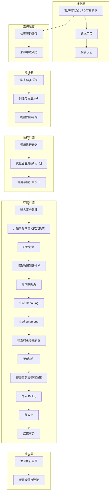

```mermaid

graph TD
    subgraph 连接层
        A[客户端发起 UPDATE 请求] --> B[建立连接]
        B --> C[权限认证]
    end

    subgraph 查询缓存
        D[检查查询缓存] --> E[未命中或跳过]
    end

    subgraph 解析器
        F[解析 SQL 语句] --> G[词法与语法分析]
        G --> H[构建内部结构]
    end

    subgraph 执行引擎
        I[调用执行计划] --> J[优化器生成执行计划]
        J --> K[调用存储引擎接口]
    end

    subgraph 存储引擎
        L[进入事务处理]
        L --> M[开始事务或自动提交模式]

        M --> N[获取行锁]
        N --> O[读取数据到缓冲池]
        O --> P[修改数据页]

        P --> Q[生成 Redo Log]
        Q --> R[生成 Undo Log]

        R --> S[检查约束与触发器]
        S --> T[更新索引]

        T --> U[提交事务或等待决策]
        U --> V[写入 Binlog]
        V --> W[释放锁]
        W --> X[结束事务]
    end

    subgraph 响应层
        Y[发送执行结果]
        Z[断开或保持连接]
    end

    A --> D
    E --> F
    H --> I
    K --> L
    X --> Y
    Y --> Z

```